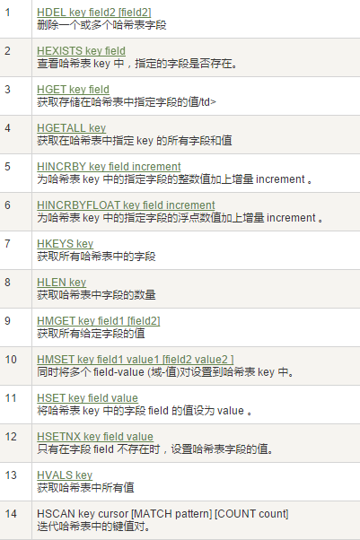

# Redis
Redis:REmote DIctionary Server(远程字典服务器)

是完全开源免费的，用C语言编写的，遵守BSD协议，是一个高性能的(key/value)分布式内存数据库，基于内存运行并支持持久化的NoSQL数据库，是当前最热门的NoSql数据库之一,也被人们称为数据结构服务器

+ 特点

  

## 安装


> redis-server redis.conf

## Redis启动后杂项基础知识讲解


+ 查找所有key

  

+ 查询k开头的key

  

## 数据类型

+ String
+ Hash（类似java里的Map）
+ List
+ Set
+ Zset

## 常用命令

Http://redisdoc.com/

### key


### String


### List


### Set


### Hash



### Zset


## redis.conf

### 单位

+ 配置大小单位,开头定义了一些基本的度量单位，只支持bytes，不支持bit
+ 对大小写不敏感


### INCLUDES

**和我们的Struts2配置文件类似，可以通过includes包含，redis.conf可以作为总闸，包含其他**


### GENERAL


+ tcp-backlog
  设置tcp的backlog，backlog其实是一个连接队列，backlog队列总和=未完成三次握手队列 + 已经完成三次握手队列。
  在高并发环境下你需要一个高backlog值来避免慢客户端连接问题。注意Linux内核会将这个值减小到/proc/sys/net/core/somaxconn的值，所以需要确认增大somaxconn和tcp_max_syn_backlog两个值
  来达到想要的效果

+ tcp-keepalive

  单位为秒，如果设置为0，则不会进行Keepalive检测，建议设置成60 


+ Syslog-enabled

  是否把日志输出到syslog中

+ Syslog-ident

  指定syslog里的日志标志

+ Syslog-facility

  指定syslog设备，值可以是USER或LOCAL0-LOCAL7

### SNAPSHOTTING快照

### REPLICATION复制

### SECURITY安全


### LIMITS限制

+ Maxclients

  设置redis同时可以与多少个客户端进行连接。默认情况下为10000个客户端。当你
  无法设置进程文件句柄限制时，redis会设置为当前的文件句柄限制值减去32，因为redis会为自
  身内部处理逻辑留一些句柄出来。如果达到了此限制，redis则会拒绝新的连接请求，并且向这
  些连接请求方发出“max number of clients reached”以作回应。

+ Maxmemory

  设置redis可以使用的内存量。一旦到达内存使用上限，redis将会试图移除内部数据，移除规则可以通过maxmemory-policy来指定。如果redis无法根据移除规则来移除内存中的数据，或者设置了“不允许移除”，
  那么redis则会针对那些需要申请内存的指令返回错误信息，比如SET、LPUSH等。

  但是对于无内存申请的指令，仍然会正常响应，比如GET等。如果你的redis是主redis（说明你的redis有从redis），那么在设置内存使用上限时，需要在系统中留出一些内存空间给同步队列缓存，只有在你设置的是“不移除”的情况下，才不用考虑这个因素

+ Maxmemory-plocy

  + volatile-lru：使用LRU算法移除key，只对设置了过期时间的键
  + allkeys-lru：使用LRU算法移除key
  + volatile-random：在过期集合中移除随机的key，只对设置了过期时间的键
  + allkeys-random：移除随机的key
  + volatile-ttl：移除那些TTL值最小的key，即那些最近要过期的key
  + noeviction：不进行移除。针对写操作，只是返回错误信息

+ Maxmemory-samples

  设置样本数量，LRU算法和最小TTL算法都并非是精确的算法，而是估算值，所以你可以设置样本的大小，
  redis默认会检查这么多个key并选择其中LRU的那个

### APPEND ONLY MODE追加

### 常见配置redis.conf介绍

```text
参数说明
redis.conf 配置项说明如下：
1. Redis默认不是以守护进程的方式运行，可以通过该配置项修改，使用yes启用守护进程
  daemonize no
2. 当Redis以守护进程方式运行时，Redis默认会把pid写入/var/run/redis.pid文件，可以通过pidfile指定
  pidfile /var/run/redis.pid
3. 指定Redis监听端口，默认端口为6379，作者在自己的一篇博文中解释了为什么选用6379作为默认端口，因为6379在手机按键上MERZ对应的号码，而MERZ取自意大利歌女Alessia Merz的名字
  port 6379
4. 绑定的主机地址
  bind 127.0.0.1
5.当 客户端闲置多长时间后关闭连接，如果指定为0，表示关闭该功能
  timeout 300
6. 指定日志记录级别，Redis总共支持四个级别：debug、verbose、notice、warning，默认为verbose
  loglevel verbose
7. 日志记录方式，默认为标准输出，如果配置Redis为守护进程方式运行，而这里又配置为日志记录方式为标准输出，则日志将会发送给/dev/null
  logfile stdout
8. 设置数据库的数量，默认数据库为0，可以使用SELECT <dbid>命令在连接上指定数据库id
  databases 16
9. 指定在多长时间内，有多少次更新操作，就将数据同步到数据文件，可以多个条件配合
  save <seconds> <changes>
  Redis默认配置文件中提供了三个条件：
  save 900 1
  save 300 10
  save 60 10000
  分别表示900秒（15分钟）内有1个更改，300秒（5分钟）内有10个更改以及60秒内有10000个更改。
 
10. 指定存储至本地数据库时是否压缩数据，默认为yes，Redis采用LZF压缩，如果为了节省CPU时间，可以关闭该选项，但会导致数据库文件变的巨大
  rdbcompression yes
11. 指定本地数据库文件名，默认值为dump.rdb
  dbfilename dump.rdb
12. 指定本地数据库存放目录
  dir ./
13. 设置当本机为slav服务时，设置master服务的IP地址及端口，在Redis启动时，它会自动从master进行数据同步
  slaveof <masterip> <masterport>
14. 当master服务设置了密码保护时，slav服务连接master的密码
  masterauth <master-password>
15. 设置Redis连接密码，如果配置了连接密码，客户端在连接Redis时需要通过AUTH <password>命令提供密码，默认关闭
  requirepass foobared
16. 设置同一时间最大客户端连接数，默认无限制，Redis可以同时打开的客户端连接数为Redis进程可以打开的最大文件描述符数，如果设置 maxclients 0，表示不作限制。当客户端连接数到达限制时，Redis会关闭新的连接并向客户端返回max number of clients reached错误信息
  maxclients 128
17. 指定Redis最大内存限制，Redis在启动时会把数据加载到内存中，达到最大内存后，Redis会先尝试清除已到期或即将到期的Key，当此方法处理 后，仍然到达最大内存设置，将无法再进行写入操作，但仍然可以进行读取操作。Redis新的vm机制，会把Key存放内存，Value会存放在swap区
  maxmemory <bytes>
18. 指定是否在每次更新操作后进行日志记录，Redis在默认情况下是异步的把数据写入磁盘，如果不开启，可能会在断电时导致一段时间内的数据丢失。因为 redis本身同步数据文件是按上面save条件来同步的，所以有的数据会在一段时间内只存在于内存中。默认为no
  appendonly no
19. 指定更新日志文件名，默认为appendonly.aof
   appendfilename appendonly.aof
20. 指定更新日志条件，共有3个可选值： 
  no：表示等操作系统进行数据缓存同步到磁盘（快） 
  always：表示每次更新操作后手动调用fsync()将数据写到磁盘（慢，安全） 
  everysec：表示每秒同步一次（折衷，默认值）
  appendfsync everysec
 
21. 指定是否启用虚拟内存机制，默认值为no，简单的介绍一下，VM机制将数据分页存放，由Redis将访问量较少的页即冷数据swap到磁盘上，访问多的页面由磁盘自动换出到内存中（在后面的文章我会仔细分析Redis的VM机制）
   vm-enabled no
22. 虚拟内存文件路径，默认值为/tmp/redis.swap，不可多个Redis实例共享
   vm-swap-file /tmp/redis.swap
23. 将所有大于vm-max-memory的数据存入虚拟内存,无论vm-max-memory设置多小,所有索引数据都是内存存储的(Redis的索引数据 就是keys),也就是说,当vm-max-memory设置为0的时候,其实是所有value都存在于磁盘。默认值为0
   vm-max-memory 0
24. Redis swap文件分成了很多的page，一个对象可以保存在多个page上面，但一个page上不能被多个对象共享，vm-page-size是要根据存储的 数据大小来设定的，作者建议如果存储很多小对象，page大小最好设置为32或者64bytes；如果存储很大大对象，则可以使用更大的page，如果不 确定，就使用默认值
   vm-page-size 32
25. 设置swap文件中的page数量，由于页表（一种表示页面空闲或使用的bitmap）是在放在内存中的，，在磁盘上每8个pages将消耗1byte的内存。
   vm-pages 134217728
26. 设置访问swap文件的线程数,最好不要超过机器的核数,如果设置为0,那么所有对swap文件的操作都是串行的，可能会造成比较长时间的延迟。默认值为4
   vm-max-threads 4
27. 设置在向客户端应答时，是否把较小的包合并为一个包发送，默认为开启
  glueoutputbuf yes
28. 指定在超过一定的数量或者最大的元素超过某一临界值时，采用一种特殊的哈希算法
  hash-max-zipmap-entries 64
  hash-max-zipmap-value 512
29. 指定是否激活重置哈希，默认为开启（后面在介绍Redis的哈希算法时具体介绍）
  activerehashing yes
30. 指定包含其它的配置文件，可以在同一主机上多个Redis实例之间使用同一份配置文件，而同时各个实例又拥有自己的特定配置文件
  include /path/to/local.conf
```

## redis持久化

### RDB

在指定的时间间隔内将内存中的数据集快照写入磁盘，也就是行话讲的Snapshot快照，它恢复时是将快照文件直接读到内存里。

Redis会单独创建（fork）一个子进程来进行持久化，会先将数据写入到一个临时文件中，待持久化过程都结束了，再用这个临时文件替换上次持久化好的文件。整个过程中，主进程是不进行任何IO操作的，这就确保了极高的性能如果需要进行大规模数据的恢复，且对于数据恢复的完整性不是非常敏感，那RDB方式要比AOF方式更加的高效。RDB的缺点是最后一次持久化后的数据可能丢失。


### AOF

以日志的形式来记录每个写操作，将Redis执行过的所有写指令记录下来(读操作不记录)，只许追加文件但不可以改写文件，redis启动之初会读取该文件重新构建数据，换言之，redis重启的话就根据日志文件的内容将写指令从前到后执行一次以完成数据的恢复工作


### 总结


