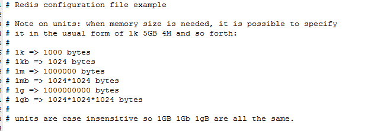

# Redis
Redis:REmote DIctionary Server(远程字典服务器)

是完全开源免费的，用C语言编写的，遵守BSD协议，是一个高性能的(key/value)分布式内存数据库，基于内存运行并支持持久化的NoSQL数据库，是当前最热门的NoSql数据库之一,也被人们称为数据结构服务器

+ 特点

  

## 安装


> redis-server redis.conf

## Redis启动后杂项基础知识讲解


+ 查找所有key

  

+ 查询k开头的key

  

## 数据类型

+ String
+ Hash（类似java里的Map）
+ List
+ Set
+ Zset

## 常用命令

Http://redisdoc.com/

### key


### String


### List


### Set


### Hash


### Zset


## redis.conf

### 单位

+ 配置大小单位,开头定义了一些基本的度量单位，只支持bytes，不支持bit
+ 对大小写不敏感



### INCLUDES

**和我们的Struts2配置文件类似，可以通过includes包含，redis.conf可以作为总闸，包含其他**


### GENERAL


+ tcp-backlog
  设置tcp的backlog，backlog其实是一个连接队列，backlog队列总和=未完成三次握手队列 + 已经完成三次握手队列。
  在高并发环境下你需要一个高backlog值来避免慢客户端连接问题。注意Linux内核会将这个值减小到/proc/sys/net/core/somaxconn的值，所以需要确认增大somaxconn和tcp_max_syn_backlog两个值
  来达到想要的效果

+ tcp-keepalive

  单位为秒，如果设置为0，则不会进行Keepalive检测，建议设置成60 


+ Syslog-enabled

  是否把日志输出到syslog中

+ Syslog-ident

  指定syslog里的日志标志

+ Syslog-facility

  指定syslog设备，值可以是USER或LOCAL0-LOCAL7

### SNAPSHOTTING快照

### REPLICATION复制

### SECURITY安全


### LIMITS限制

+ Maxclients

  设置redis同时可以与多少个客户端进行连接。默认情况下为10000个客户端。当你
  无法设置进程文件句柄限制时，redis会设置为当前的文件句柄限制值减去32，因为redis会为自
  身内部处理逻辑留一些句柄出来。如果达到了此限制，redis则会拒绝新的连接请求，并且向这
  些连接请求方发出“max number of clients reached”以作回应。

+ Maxmemory

  设置redis可以使用的内存量。一旦到达内存使用上限，redis将会试图移除内部数据，移除规则可以通过maxmemory-policy来指定。如果redis无法根据移除规则来移除内存中的数据，或者设置了“不允许移除”，
  那么redis则会针对那些需要申请内存的指令返回错误信息，比如SET、LPUSH等。

  但是对于无内存申请的指令，仍然会正常响应，比如GET等。如果你的redis是主redis（说明你的redis有从redis），那么在设置内存使用上限时，需要在系统中留出一些内存空间给同步队列缓存，只有在你设置的是“不移除”的情况下，才不用考虑这个因素

+ Maxmemory-plocy

  + volatile-lru：使用LRU算法移除key，只对设置了过期时间的键
  + allkeys-lru：使用LRU算法移除key
  + volatile-random：在过期集合中移除随机的key，只对设置了过期时间的键
  + allkeys-random：移除随机的key
  + volatile-ttl：移除那些TTL值最小的key，即那些最近要过期的key
  + noeviction：不进行移除。针对写操作，只是返回错误信息

+ Maxmemory-samples

  设置样本数量，LRU算法和最小TTL算法都并非是精确的算法，而是估算值，所以你可以设置样本的大小，
  redis默认会检查这么多个key并选择其中LRU的那个

### APPEND ONLY MODE追加

### 常见配置redis.conf介绍

```text
参数说明
redis.conf 配置项说明如下：
1. Redis默认不是以守护进程的方式运行，可以通过该配置项修改，使用yes启用守护进程
  daemonize no
2. 当Redis以守护进程方式运行时，Redis默认会把pid写入/var/run/redis.pid文件，可以通过pidfile指定
  pidfile /var/run/redis.pid
3. 指定Redis监听端口，默认端口为6379，作者在自己的一篇博文中解释了为什么选用6379作为默认端口，因为6379在手机按键上MERZ对应的号码，而MERZ取自意大利歌女Alessia Merz的名字
  port 6379
4. 绑定的主机地址
  bind 127.0.0.1
5.当 客户端闲置多长时间后关闭连接，如果指定为0，表示关闭该功能
  timeout 300
6. 指定日志记录级别，Redis总共支持四个级别：debug、verbose、notice、warning，默认为verbose
  loglevel verbose
7. 日志记录方式，默认为标准输出，如果配置Redis为守护进程方式运行，而这里又配置为日志记录方式为标准输出，则日志将会发送给/dev/null
  logfile stdout
8. 设置数据库的数量，默认数据库为0，可以使用SELECT <dbid>命令在连接上指定数据库id
  databases 16
9. 指定在多长时间内，有多少次更新操作，就将数据同步到数据文件，可以多个条件配合
  save <seconds> <changes>
  Redis默认配置文件中提供了三个条件：
  save 900 1
  save 300 10
  save 60 10000
  分别表示900秒（15分钟）内有1个更改，300秒（5分钟）内有10个更改以及60秒内有10000个更改。
 
10. 指定存储至本地数据库时是否压缩数据，默认为yes，Redis采用LZF压缩，如果为了节省CPU时间，可以关闭该选项，但会导致数据库文件变的巨大
  rdbcompression yes
11. 指定本地数据库文件名，默认值为dump.rdb
  dbfilename dump.rdb
12. 指定本地数据库存放目录
  dir ./
13. 设置当本机为slav服务时，设置master服务的IP地址及端口，在Redis启动时，它会自动从master进行数据同步
  slaveof <masterip> <masterport>
14. 当master服务设置了密码保护时，slav服务连接master的密码
  masterauth <master-password>
15. 设置Redis连接密码，如果配置了连接密码，客户端在连接Redis时需要通过AUTH <password>命令提供密码，默认关闭
  requirepass foobared
16. 设置同一时间最大客户端连接数，默认无限制，Redis可以同时打开的客户端连接数为Redis进程可以打开的最大文件描述符数，如果设置 maxclients 0，表示不作限制。当客户端连接数到达限制时，Redis会关闭新的连接并向客户端返回max number of clients reached错误信息
  maxclients 128
17. 指定Redis最大内存限制，Redis在启动时会把数据加载到内存中，达到最大内存后，Redis会先尝试清除已到期或即将到期的Key，当此方法处理 后，仍然到达最大内存设置，将无法再进行写入操作，但仍然可以进行读取操作。Redis新的vm机制，会把Key存放内存，Value会存放在swap区
  maxmemory <bytes>
18. 指定是否在每次更新操作后进行日志记录，Redis在默认情况下是异步的把数据写入磁盘，如果不开启，可能会在断电时导致一段时间内的数据丢失。因为 redis本身同步数据文件是按上面save条件来同步的，所以有的数据会在一段时间内只存在于内存中。默认为no
  appendonly no
19. 指定更新日志文件名，默认为appendonly.aof
   appendfilename appendonly.aof
20. 指定更新日志条件，共有3个可选值： 
  no：表示等操作系统进行数据缓存同步到磁盘（快） 
  always：表示每次更新操作后手动调用fsync()将数据写到磁盘（慢，安全） 
  everysec：表示每秒同步一次（折衷，默认值）
  appendfsync everysec
 
21. 指定是否启用虚拟内存机制，默认值为no，简单的介绍一下，VM机制将数据分页存放，由Redis将访问量较少的页即冷数据swap到磁盘上，访问多的页面由磁盘自动换出到内存中（在后面的文章我会仔细分析Redis的VM机制）
   vm-enabled no
22. 虚拟内存文件路径，默认值为/tmp/redis.swap，不可多个Redis实例共享
   vm-swap-file /tmp/redis.swap
23. 将所有大于vm-max-memory的数据存入虚拟内存,无论vm-max-memory设置多小,所有索引数据都是内存存储的(Redis的索引数据 就是keys),也就是说,当vm-max-memory设置为0的时候,其实是所有value都存在于磁盘。默认值为0
   vm-max-memory 0
24. Redis swap文件分成了很多的page，一个对象可以保存在多个page上面，但一个page上不能被多个对象共享，vm-page-size是要根据存储的 数据大小来设定的，作者建议如果存储很多小对象，page大小最好设置为32或者64bytes；如果存储很大大对象，则可以使用更大的page，如果不 确定，就使用默认值
   vm-page-size 32
25. 设置swap文件中的page数量，由于页表（一种表示页面空闲或使用的bitmap）是在放在内存中的，，在磁盘上每8个pages将消耗1byte的内存。
   vm-pages 134217728
26. 设置访问swap文件的线程数,最好不要超过机器的核数,如果设置为0,那么所有对swap文件的操作都是串行的，可能会造成比较长时间的延迟。默认值为4
   vm-max-threads 4
27. 设置在向客户端应答时，是否把较小的包合并为一个包发送，默认为开启
  glueoutputbuf yes
28. 指定在超过一定的数量或者最大的元素超过某一临界值时，采用一种特殊的哈希算法
  hash-max-zipmap-entries 64
  hash-max-zipmap-value 512
29. 指定是否激活重置哈希，默认为开启（后面在介绍Redis的哈希算法时具体介绍）
  activerehashing yes
30. 指定包含其它的配置文件，可以在同一主机上多个Redis实例之间使用同一份配置文件，而同时各个实例又拥有自己的特定配置文件
  include /path/to/local.conf
```

## redis持久化

### RDB

在指定的时间间隔内将内存中的数据集快照写入磁盘，也就是行话讲的Snapshot快照，它恢复时是将快照文件直接读到内存里。

Redis会单独创建（fork）一个子进程来进行持久化，会先将数据写入到一个临时文件中，待持久化过程都结束了，再用这个临时文件替换上次持久化好的文件。整个过程中，主进程是不进行任何IO操作的，这就确保了极高的性能如果需要进行大规模数据的恢复，且对于数据恢复的完整性不是非常敏感，那RDB方式要比AOF方式更加的高效。RDB的缺点是最后一次持久化后的数据可能丢失。

https://www.cnblogs.com/ysocean/p/9114268.html


### AOF

以日志的形式来记录每个写操作，将Redis执行过的所有写指令记录下来(读操作不记录)，只许追加文件但不可以改写文件，redis启动之初会读取该文件重新构建数据，换言之，redis重启的话就根据日志文件的内容将写指令从前到后执行一次以完成数据的恢复工作


### 总结


+ 性能建议

  因为RDB文件只用作后备用途，建议只在Slave上持久化RDB文件，而且只要15分钟备份一次就够了，只保留save 900 1这条规则。

  如果Enalbe AOF，好处是在最恶劣情况下也只会丢失不超过两秒数据，启动脚本较简单只load自己的AOF文件就可以了。代价一是带来了持续的IO，二是AOF rewrite的最后将rewrite过程中产生的新数据写到新文件造成的阻塞几乎是不可避免的。只要硬盘许可，应该尽量减少AOF rewrite的频率，AOF重写的基础大小默认值64M太小了，可以设到5G以上。默认超过原大小100%大小时重写可以改到适当的数值。

  如果不Enable AOF ，仅靠Master-Slave Replication 实现高可用性也可以。能省掉一大笔IO也减少了rewrite时带来的系统波动。代价是如果Master/Slave同时倒掉，会丢失十几分钟的数据，启动脚本也要比较两个Master/Slave中的RDB文件，载入较新的那个。新浪微博就选用了这种架构

## redis事务

可以一次执行多个命令，本质是一组命令的集合。一个事务中的所有命令都会序列化，按顺序地串行化执行而不会被其它命令插入，不许加塞


+ 正常执行

  

+ 放弃事务

  

+ 全体连坐

  

+ 冤头债主

  

+ watch监控

  + 悲观锁

    悲观锁(Pessimistic Lock), 顾名思义，就是很悲观，每次去拿数据的时候都认为别人会修改，所以每次在拿数据的时候都会上锁，这样别人想拿这个数据就会block直到它拿到锁。传统的关系型数据库里边就用到了很多这种锁机制，比如行锁，表锁等，读锁，写锁等，都是在做操作之前先上锁

  + 乐观锁

    乐观锁(Optimistic Lock), 顾名思义，就是很乐观，每次去拿数据的时候都认为别人不会修改，所以不会上锁，但是在更新的时候会判断一下在此期间别人有没有去更新这个数据，可以使用版本号等机制。乐观锁适用于多读的应用类型，这样可以提高吞吐量，

    乐观锁策略:提交版本必须大于记录当前版本才能执行更新

  

  

## redis发布订阅

进程间的一种消息通信模式：发送者(pub)发送消息，订阅者(sub)接收消息。


+ 命令

  

+ 案例

  先订阅后发布后才能收到消息，

  + 可以一次性订阅多个，SUBSCRIBE c1 c2 c3
  + 消息发布，PUBLISH c2 hello-redis
  + 订阅多个，通配符*， PSUBSCRIBE new*
  + 收取消息， PUBLISH new1 redis2015

## redis复制

行话：也就是我们所说的主从复制，主机数据更新后根据配置和策略，自动同步到备机的master/slaver机制，Master以写为主，Slave以读为主

读写分离、容灾分布

### 配置

+ 配从不配主

+ 从库配置

  slaveof 主库IP 主库端口

  + 每次与master断开之后，都需要重新连接，除非你配置进redis.conf文件
  + Info replication

+ 修改配置文件细节操作

+ 常用3招


+ 只能主机写 从机没有写权限

+ 主机宕机 从机不会上位 会继续保持 等待主机重连

+ 从机宕机 如果没有配置到conf ，需要手动连接。> SLAVEOF ip port

+ 薪火相传

  + 上一个Slave可以是下一个slave的Master，Slave同样可以接收其他slaves的连接和同步请求，那么该slave作为了链条中下一个的master,可以有效减轻master的写压力
  + 中途变更转向:会清除之前的数据，重新建立拷贝最新的
  + Slaveof 新主库IP 新主库端口

+ 反客为主

  > SLAVEOF no one

  使当前数据库停止与其他数据库的同步，转成主数据库

### 复制原理

Slave启动成功连接到master后会发送一个sync命令

Master接到命令启动后台的存盘进程，同时收集所有接收到的用于修改数据集命令，在后台进程执行完毕之后，master将传送整个数据文件到slave,以完成一次完全同步

全量复制：而slave服务在接收到数据库文件数据后，将其存盘并加载到内存中。

增量复制：Master继续将新的所有收集到的修改命令依次传给slave,完成同步

但是只要是重新连接master,一次完全同步（全量复制)将被自动执行

### 哨兵模式

反客为主的自动版，能够后台监控主机是否故障，如果故障了根据投票数自动将从库转换为主库

+ 新建文件sentinel.conf文件，名字绝不能错

+  sentinel monitor 被监控数据库名字(自己起名字) 127.0.0.1 6379 1

+ 上面最后一个数字1，表示主机挂掉后salve投票看让谁接替成为主机，得票数多少后成为主机

  

+ 启动哨兵

  + Redis-sentinel /myredis/sentinel.conf 
  + 上述目录依照各自的实际情况配置，可能目录不同

  

+ 原有的master挂了 重新投票选新的master

  

+ 原来的master连接后，变成从机

  

### 复制缺点

由于所有的写操作都是先在Master上操作，然后同步更新到Slave上，所以从Master同步到Slave机器有一定的延迟，当系统很繁忙的时候，延迟问题会更加严重，Slave机器数量的增加也会使这个问题更加严重。


## Java客户端Jedis

### 测试

```java
public class RedisTest {
    public static void main(String[] args){
        Jedis jedis = new Jedis("192.168.52.100",6379);
        System.out.println(jedis.ping());
    }
}
```

### 事务

```java
package com.ntuzy.redis;

import redis.clients.jedis.Jedis;
import redis.clients.jedis.Transaction;

/**
 * @Author IamZY
 * @create 2020/2/18 21:09
 */
public class TXTest {

    public boolean transMethod() {
        Jedis jedis = new Jedis("127.0.0.1", 6379);
        int balance;// 可用余额
        int debt;// 欠额
        int amtToSubtract = 10;// 实刷额度

        jedis.watch("balance");
        //jedis.set("balance","5");//此句不该出现，讲课方便。模拟其他程序已经修改了该条目
        balance = Integer.parseInt(jedis.get("balance"));
        if (balance < amtToSubtract) {
            jedis.unwatch();
            System.out.println("modify");
            return false;
        } else {
            System.out.println("***********transaction");
            Transaction transaction = jedis.multi();
            transaction.decrBy("balance", amtToSubtract);
            transaction.incrBy("debt", amtToSubtract);
            transaction.exec();
            balance = Integer.parseInt(jedis.get("balance"));
            debt = Integer.parseInt(jedis.get("debt"));

            System.out.println("*******" + balance);
            System.out.println("*******" + debt);
            return true;
        }
    }

    /**
     * 通俗点讲，watch命令就是标记一个键，如果标记了一个键， 在提交事务前如果该键被别人修改过，那事务就会失败，这种情况通常可以在程序中
     * 重新再尝试一次。
     * 首先标记了键balance，然后检查余额是否足够，不足就取消标记，并不做扣减； 足够的话，就启动事务进行更新操作，
     * 如果在此期间键balance被其它人修改， 那在提交事务（执行exec）时就会报错， 程序中通常可以捕获这类错误再重新执行一次，直到成功。
     */
    public static void main(String[] args) {
//        Jedis jedis = new Jedis("192.168.52.100",6379);
//        Transaction tx = jedis.multi();
//        tx.set("k1","v1");
        //Redis Discard 命令用于取消事务，放弃执行事务块内的所有命令。
//        tx.exec();

        TXTest test = new TXTest();
        boolean retValue = test.transMethod();
        System.out.println("main retValue-------: " + retValue);

    }

}
```

### 主从复制

```java
/**
 * @Author IamZY
 * @create 2020/2/18 21:21
 */
public class TestMS {
    public static void main(String[] args) throws InterruptedException
    {
        Jedis jedis_M = new Jedis("127.0.0.1",6379);
        Jedis jedis_S = new Jedis("127.0.0.1",6380);

        jedis_S.slaveof("127.0.0.1",6379);

        jedis_M.set("k6","v6");
        Thread.sleep(500);
        System.out.println(jedis_S.get("k6"));
    }
}
```

### JedisPool

>
> JedisPool的配置参数大部分是由JedisPoolConfig的对应项来赋值的。
>
> maxActive：控制一个pool可分配多少个jedis实例，通过pool.getResource()来获取；如果赋值为-1，则表示不限制；如果pool已经分配了maxActive个jedis实例，则此时pool的状态为exhausted。
> maxIdle：控制一个pool最多有多少个状态为idle(空闲)的jedis实例；
> whenExhaustedAction：表示当pool中的jedis实例都被allocated完时，pool要采取的操作；默认有三种。
>  WHEN_EXHAUSTED_FAIL --> 表示无jedis实例时，直接抛出NoSuchElementException；
>  WHEN_EXHAUSTED_BLOCK --> 则表示阻塞住，或者达到maxWait时抛出JedisConnectionException；
>  WHEN_EXHAUSTED_GROW --> 则表示新建一个jedis实例，也就说设置的maxActive无用；
> maxWait：表示当borrow一个jedis实例时，最大的等待时间，如果超过等待时间，则直接抛JedisConnectionException；
> testOnBorrow：获得一个jedis实例的时候是否检查连接可用性（ping()）；如果为true，则得到的jedis实例均是可用的；
>
> testOnReturn：return 一个jedis实例给pool时，是否检查连接可用性（ping()）；
>
> testWhileIdle：如果为true，表示有一个idle object evitor线程对idle object进行扫描，如果validate失败，此object会被从pool中drop掉；这一项只有在timeBetweenEvictionRunsMillis大于0时才有意义；
>
> timeBetweenEvictionRunsMillis：表示idle object evitor两次扫描之间要sleep的毫秒数；
>
> numTestsPerEvictionRun：表示idle object evitor每次扫描的最多的对象数；
>
> minEvictableIdleTimeMillis：表示一个对象至少停留在idle状态的最短时间，然后才能被idle object evitor扫描并驱逐；这一项只有在timeBetweenEvictionRunsMillis大于0时才有意义；
>
> softMinEvictableIdleTimeMillis：在minEvictableIdleTimeMillis基础上，加入了至少minIdle个对象已经在pool里面了。如果为-1，evicted不会根据idle time驱逐任何对象。如果minEvictableIdleTimeMillis>0，则此项设置无意义，且只有在timeBetweenEvictionRunsMillis大于0时才有意义；
>
> lifo：borrowObject返回对象时，是采用DEFAULT_LIFO（last in first out，即类似cache的最频繁使用队列），如果为False，则表示FIFO队列；
>
> ==================================================================================================================
> 其中JedisPoolConfig对一些参数的默认设置如下：
> testWhileIdle=true
> minEvictableIdleTimeMills=60000
> timeBetweenEvictionRunsMillis=30000
> numTestsPerEvictionRun=-1

+ JedisPoolUtil

```java
package com.ntuzy.redis;

import redis.clients.jedis.Jedis;
import redis.clients.jedis.JedisPool;
import redis.clients.jedis.JedisPoolConfig;

/**
 * @Author IamZY
 * @create 2020/2/18 21:24
 */
public class JedisPoolUtil {

    private static volatile JedisPool jedisPool = null;//被volatile修饰的变量不会被本地线程缓存，对该变量的读写都是直接操作共享内存。

    private JedisPoolUtil() {
    }

    public static JedisPool getJedisPoolInstance() {
        if (null == jedisPool) {
            synchronized (JedisPoolUtil.class) {
                if (null == jedisPool) {
                    JedisPoolConfig poolConfig = new JedisPoolConfig();
                    poolConfig.setMaxActive(1000);
                    poolConfig.setMaxIdle(32);
                    poolConfig.setMaxWait(100 * 1000);
                    poolConfig.setTestOnBorrow(true);

                    jedisPool = new JedisPool(poolConfig, "192.168.52.100", 6379);
                }
            }
        }
        return jedisPool;
    }

    public static void release(JedisPool jedisPool, Jedis jedis) {
        if (null != jedis) {
            jedisPool.returnResourceObject(jedis);
        }
    }
}
```

+ TestPool

  ```java
  package com.ntuzy.redis;
  
  import redis.clients.jedis.Jedis;
  import redis.clients.jedis.JedisPool;
  
  /**
   * @Author IamZY
   * @create 2020/2/18 21:24
   */
  public class TestPool {
      public static void main(String[] args){
          JedisPool jedisPool = JedisPoolUtil.getJedisPoolInstance();
          Jedis jedis = null;
  
          try
          {
              jedis = jedisPool.getResource();
              jedis.set("k18","v183");
  
          } catch (Exception e) {
              e.printStackTrace();
          }finally{
              JedisPoolUtil.release(jedisPool, jedis);
          }
  
      }
  }
  
  ```

  


